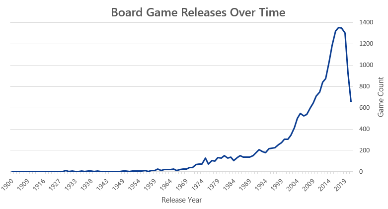

# 🎲 Board Game Analytics Dashboard

## Introduction
This project analyzes board game data from Board Game Geek and shares insights through an interactive Excel dashboard.  

The goal was to explore patterns in game ratings, popularity, and mechanics, while also building a tool to help users quickly search for statistics on specific games.  

---

## Dashboard File
My final dashboard is in [**Board_Game_Dashboard.xlsx**](Dashboard/Board%20Game%20Dashboard.xlsx).

---

## Excel Skills Used
The following Excel skills were utilized for analysis:

- Charts (Line, Bar, Scatterplot)
- Formulas & Functions
- Power Query
- Power Pivot
- DAX Functions
- Data Validation

---

##  Getting the Data Ready (Power Query)

Before we visualize anything, we need clean data. First I took these steps:  

- Tidied up the raw data: removed extra columns, fixed data types, handled nulls
- Pivoted and reshaped tables such as the game mechanics table to improve data analysis
- Standardized column names and formats 

  

---

##  Modeling the Data (Power Pivot)

Next up: building a data model that connects everything smoothly:

- Built relationships between games, publishers, mechanics, etc.
- Created data model to enable cross-table analysis
- Used DAX expressions to allow cross-filtering  

---

##  Exploring the Data (Visuals)

Then came the fun part- creating visualizations:

- **Line chart** — number of board game releases by year
  
  
- **Scatterplot** — average rating vs. game complexity scores
  

- **Bar chart** — Top 10 game mechanics
  

- **Bar chart** — Top 10 most popular games
  

---

##  Creating the Dashboard

All the pieces came together in a dashboard sheet complete with a slicer allowing end users to filter data by decade of release date.

---

##  Bonus Tool: Game Finder via XLOOKUP

Beyond the dashboard, I made a “Game Finder” tab where you can type a game name, and it returns the game’s rating, complexity, and more using **XLOOKUP**.

---

##  Conclusions

As a board game geek myself, I embarked on this Excel-based project to uncover insights about the board game community. By leveraging Excel features like Power Query, PivotTables, DAX, and charts, I discovered key insights and trends in the board game industry. 

---
## Data Source

This project uses the [Board Games Database from BoardGameGeek](https://www.kaggle.com/datasets/threnjen/board-games-database-from-boardgamegeek), published on Kaggle by **threnjen**.  
The original data is provided by [BoardGameGeek](https://boardgamegeek.com/).  

This project is for educational and portfolio purposes only.

